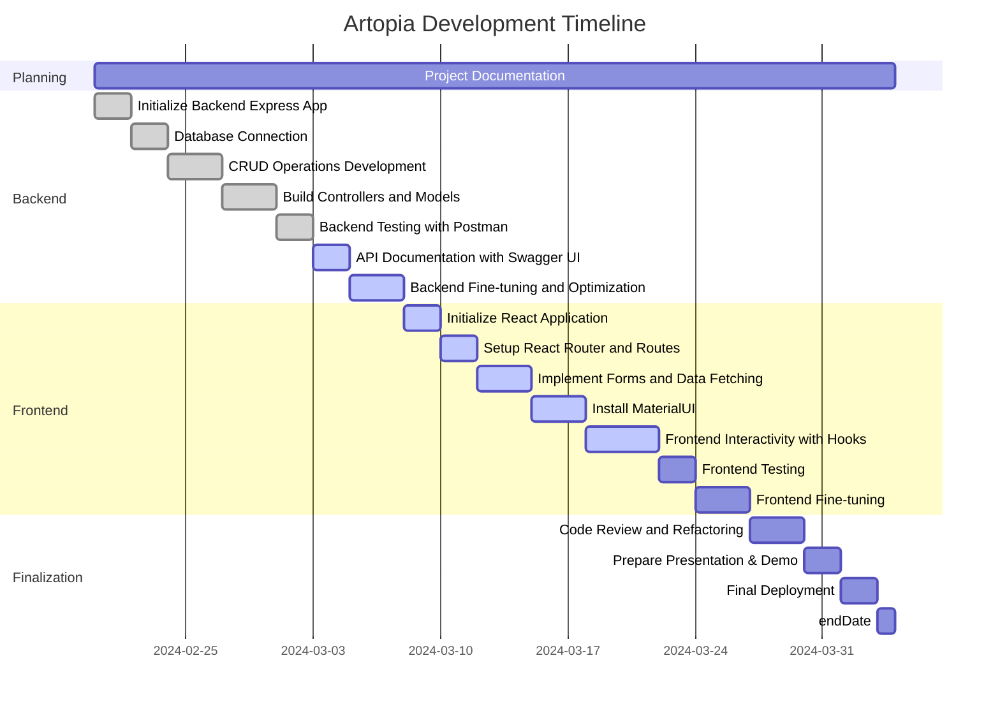

```mermaid
    gantt 
    dateFormat  YYYY-MM-DD
    title Artopia Development Timeline

    section Planning                    
    Project Documentation               :doc1, 2024-02-20, 2024-04-04

    section Backend
    Initialize Backend Express App      :done,    b1, 2024-02-20, 2d
    Database Connection                 :done,    b2, after b1, 2d
    CRUD Operations Development         :done,    b3, after b2, 3d
    Build Controllers and Models        :done,    b4, after b3, 3d
    Backend Testing with Postman        :done,    b5, after b4, 2d
    API Documentation with Swagger UI   :active,  b6, after b5, 2d
    Backend Fine-tuning and Optimization:active,  b7, after b6, 3d

    section Frontend
    Initialize React Application        :active,  f1, after b7, 2d
    Setup React Router and Routes       :active,  f2, after f1, 2d
    Implement Forms and Data Fetching   :active,  f3, after f2, 3d
    Install MaterialUI                  :active,  f4, after f3, 3d
    Frontend Interactivity with Hooks   :active,  f5, after f4, 4d
    Frontend Testing                    :         f6, after f5, 2d
    Frontend Fine-tuning                :         f7, after f6, 3d

    section Finalization
    Code Review and Refactoring         :         cr, after f7, 3d
    Prepare Presentation & Demo         :         pd, after cr, 2d
    Final Deployment                    :         fd, after pd, 2d

    endDate                             :         2024-04-04
```