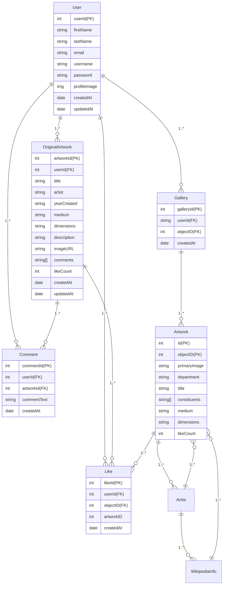

```mermaid
erDiagram
    User ||--o{ Like : "1..*"
    User ||--o{ Comment : "1..*"
    User ||--o{ OriginalArtwork : "1..*"
    User ||--o{ Gallery : "1..*"
    OriginalArtwork ||--o{ Comment : "1..*"
    OriginalArtwork ||--o{ Like : "1..*"
    Gallery ||--o{ Artwork : "1..*"
    Artwork ||--o{ Artist : "1..*"
    Artwork ||--o{ Like : "1..*"
    Artist ||--o{ Artwork : "1..*"
    Artist ||--o{ WikipediaInfo : "1..*"
    WikipediaInfo ||--o{ Artwork : "1..*"

    User {
        int userId(PK)
        string firstName
        string lastName
        string email
        string username
        string password
        img profileImage
        date createdAt
        date updatedAt
    }

    Gallery {
        int galleryId(PK)
        string userId(FK)
        int objectID(FK)
        date createdAt
    }

    Artwork {
        int id(PK)
        int objectID(PK)
        string primaryImage
        string department
        string title
        string[] constituents
        string medium
        string dimensions
        int likeCount
    }

    OriginalArtwork {
        int artworkId(PK)
        int userId(FK)
        string title
        string artist
        string yearCreated
        string medium
        string dimensions
        string description
        string imageURL
        string[] comments
        int likeCount
        date createdAt
        date updatedAt
    }

    Like {
        int likeId(PK)
        int userId(FK)
        int objectID(FK)
        int artworkID
        date createdAt
    }

    Comment {
        int commentId(PK)
        int userId(FK)
        int artworkId(FK)
        string commentText
        date createdAt
    }
```
