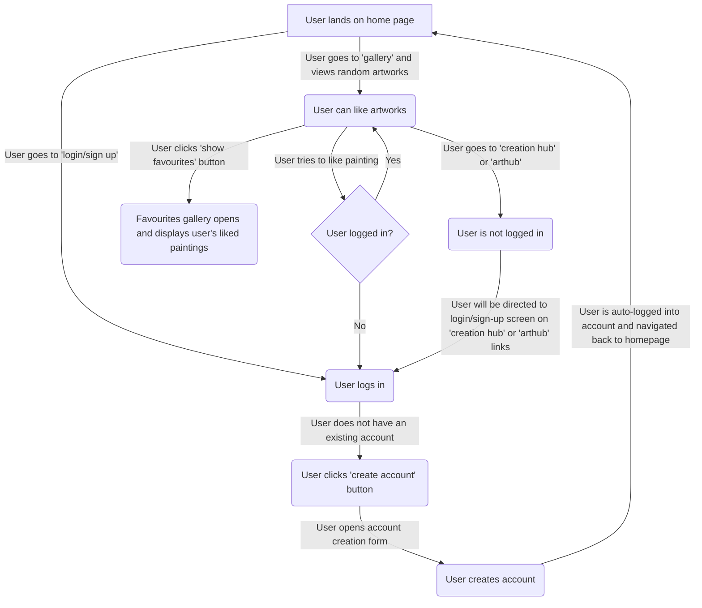

```mermaid
flowchart
    A[User lands on home page] -->|User goes to 'login/sign up'| B(User logs in)
    A -->|User goes to 'gallery' and views random artworks| C
    C -->|User tries to like painting| D{User logged in?}
    D -->|No| B
    D -->|Yes| C(User can like artworks)
    C -->|User clicks 'show favourites' button| E(Favourites gallery opens and displays user's liked paintings)
    C -->|User goes to 'creation hub' or 'arthub'| F(User is not logged in)
    F -->|User will be directed to login/sign-up screen on 'creation hub' or 'arthub' links| B
    B -->|User does not have an existing account| G(User clicks 'create account' button)
    G -->|User opens account creation form| H(User creates account)
    H -->|User is auto-logged into account and navigated back to homepage| A
```
