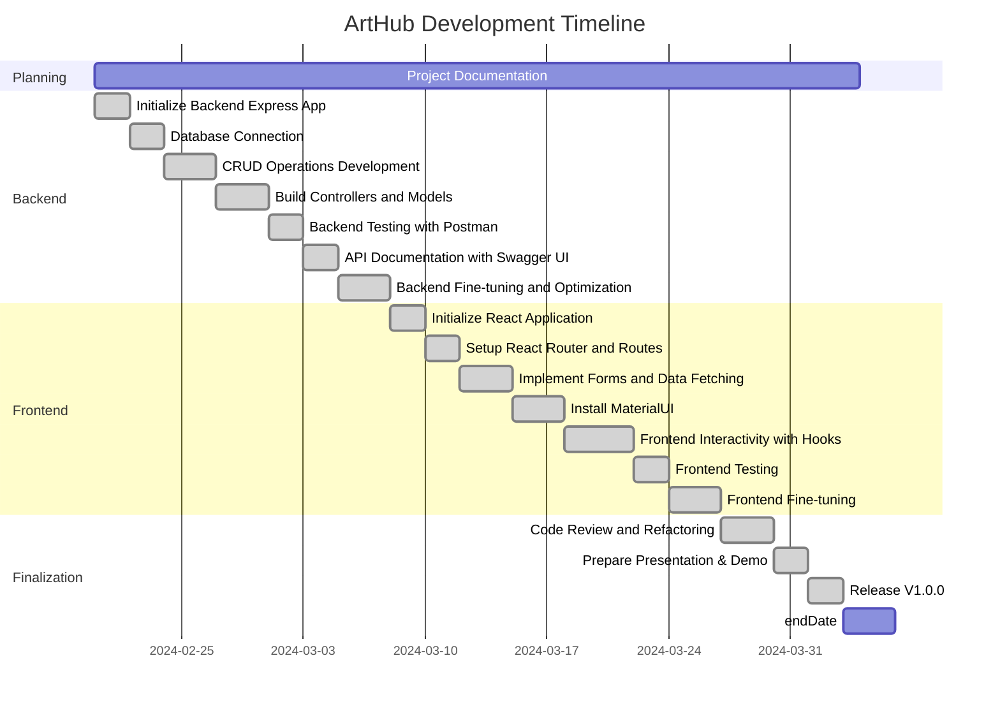
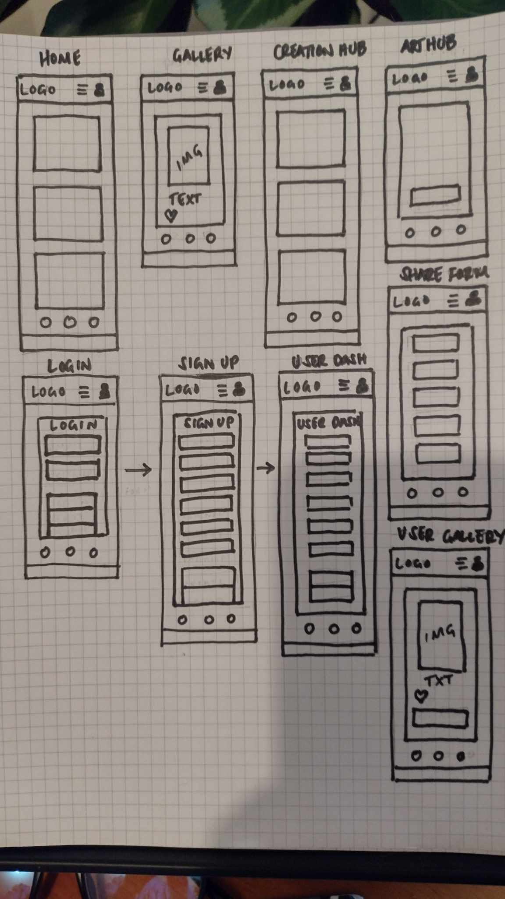
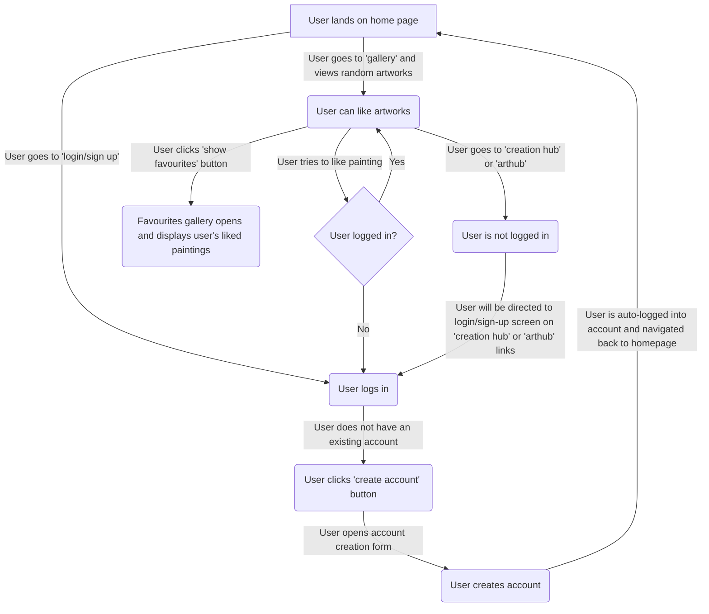
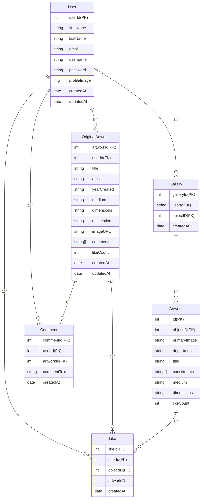

# 🎨 ArtHub: Discover, Create, Share 🖌️

## Table of Contents:

- [ArtHub](#arthub)
- [Planning and Design](#planning-and-design)
  - [Gantt Chart](#gantt-chart)
  - [Wireframes](#wireframes)
  - [User Flow](#user-flow)
  - [Color Palette and Theme](#color-palette-and-theme)
  - [Figma Designs](#figma-designs)
  - [Entity Relationship Diagram (ERD)](#entity-relationship-diagram-erd)
- [Features](#features)
- [Getting Started](#getting-started)
  - [Prerequisites](#prerequisites)
  - [Installation](#installation)
- [Testing](#testing)
- [Built With](#built-with)
- [Usage](#usage)
  - [Logging In](#logging-in)
  - [Interacting with Artworks](#interacting-with-artworks)
  - [Using Art Creation Tools](#using-art-creation-tools)
  - [Sharing and Social Features](#sharing-and-social-features)
- [Contributing](#contributing)
- [License](#license)
- [Contact](#contact)
- [Acknowledgements](#acknowledgements)
- [Troubleshooting/Common Issues](#troubleshootingcommon-issues)
- [Project Status](#project-status)
- [Releases](#releases)

# ArtHub

Welcome to ArtHub, where creativity meets community—a digital sanctuary crafted for artists, art students, and enthusiasts from all corners of the globe. Drawing from the illustrious collection of The Metropolitan Museum of Art, we've built a bridge between history's most treasured artworks and today's digital landscape.

ArtHub offers a rich, interactive platform that allows users to explore the depth and diversity of art. Users can marvel at the masterpieces housed within The Met, or dive into our comprehensive suite of digital creation tools to bring their artistic visions to life. Beyond mere appreciation, ArtHub fosters a vibrant space where creators can share their work, connect with fellow art lovers, and engage actively in a thriving artistic ecosystem.

Whether you're looking to immerse yourself in the world's finest art, create and share your own pieces, or participate in community-driven art projects, ArtHub is your destination. Our mission is to democratize access to art, fuel creativity, and build a connected community of art aficionados and creators alike.

Join us at ArtHub—your portal to art discovery, creation, and collaboration.

## Planning and Design

Designing ArtHub has been an exercise in balancing aesthetics with functionality. Our goal has been to create a visually relaxing environment that does not distract from the featured artwork, while also ensuring a seamless user experience. Here’s a glance at some of the design and planning resources that have gone into making ArtHub intuitive and enjoyable to use.

### Gantt Chart

The Gantt chart provided a timeline and a project management roadmap depicting the scheduling of tasks, milestones, and deliverables.



### Wireframes

Early-stage wireframing was crucial in mapping out the user interface and experience. The wireframes laid the foundation for ArtHub’s user flow, ensuring a logical transition between different sections and functionalities of the website.



_Wireframe showcasing the basic layout and design architecture of ArtHub._

## User Flow

### Landing on the Home Page

- When a user lands on the home page, they are presented with options to log in or sign up for an account.
- Alternatively, users can navigate to the gallery section to view random artworks.

### Gallery Interaction

- In the gallery, users can view random artworks and have the option to like a painting.
- If a user tries to like a painting without being logged in, they are redirected to the login/sign-up screen.
- Once logged in, users can go back to the gallery and like artworks.

### Favourites Gallery

- Users can click on the 'show favourites' button to open a favourites gallery that displays the paintings they have liked.

### Creation Hub and Art Hub

- If a user clicks on the 'creation hub' or 'art hub' links without being logged in, they will be directed to the login/sign-up screen.
- Users without existing accounts can click on the 'create account' button to open the account creation form.
- After creating an account, users are automatically logged in and navigated back to the homepage.



### Color Palette and Theme

Through careful consideration, we have developed a color palette and themes that complement the artistic content and create a soothing browsing experience. To view the light and dark themes along with the custom colors, please refer to our [Visual Design document](./Documents/Mock-up/visualDesigns.md).

### Figma Designs

Our Figma designs delve deeper into the aesthetic aspects of ArtHub, reflecting our choice of typography, spacing, and the overall look and feel. You can explore our intricate designs and thought process on [Figma](https://www.figma.com/file/khzNXnBHdNSOci3Ti5d7xm/ArtHub?type=design&node-id=0%3A1&mode=design&t=fyvtAM4PWO1U6PK5-1).

### Entity Relationship Diagram (ERD)

The ERD outlines the database schema and the relationships between data entities which are critical for the backend structure of ArtHub.



For an in-depth look at our design standards, theme specifications, and detailed color schemes, view our [Visual Design document](./Documents/Mock-up/visualDesigns.md).

## Features

**Artistic Exploration at Your Fingertips**: With ArtHub, users embark on a visual journey through diverse epochs of art history. Delve into a curated gallery of masterpieces, each accompanied by detailed information to enrich your understanding of the artwork and its creator.

**Personalized User Accounts**: Create your unique profile and curate your art experience. Personalize your space by liking your favorite pieces and build a collection that speaks to your aesthetic. Your virtual gallery grows with you as you explore and interact with new artworks.

**Robust Admin Controls**: Maintain a harmonious community with powerful administrative tools. Monitor content, ensure compliance with community guidelines, and provide a safe, welcoming environment for all users to share their passion for art.

**Dynamic Artwork Interaction**: Engage with art on a deeper level. Share your favorite pieces with friends via social media, express your thoughts and interpretations through comments, and contribute to the vibrant discourse within the ArtHub community.

**Discover & Learn**: Open the doors to random encounters with beauty and knowledge. The 'Discover' feature randomizes the presentation of artworks, providing unexpected moments of inspiration. Expand your artistry by learning the history behind each piece and exploring the stories of iconic artists.

**Creative Canvas**: Unleash your creativity using ArtHub's digital art tools. Whether sketching a quick concept or composing a complex piece, our integrated creation suite supports your artistic process with a variety of brushes, colors, and layers.

**Community Collaboration**: Participate in community challenges, share your artwork, and connect with like-minded individuals. ArtHub embraces the spirit of collaboration and mutual learning, offering a platform for artists to grow together.

**Art Sharing and Visibility**: Showcase your art to the world. Upload your creations to the community gallery, receive feedback, and find new audiences to appreciate your work. ArtHub is not just a platform; it's a stage for emerging and established artists alike.

For a more detailed look at our complete range of features and user stories see our [Functional Requirements document](./Documents/Other/functionalRequirements.md).

## Getting Started

These instructions will get you a copy of the project up and running on your local machine for development and testing purposes.

### Prerequisites

- Node.js and npm installed. You can download them from [here](https://nodejs.org/).
- A MySQL server running locally or remotely which you can access.

### Installation

1. Clone the repo:

   ```sh
   git clone https://github.com/institutedata/capstone-SimianPrimus

   ```

2. Install NPM packages:

   ```sh
   npm install

   ```

3. Start the development server:
   ```sh
   npm run start:dev
   ```

## Testing

ArtHub has undergone extensive user interface testing to ensure each feature performs as intended and provides a seamless experience for our users. Through this rigorous process, we have verified the functionality of:

- User login and account creation, ensuring secure access and easy onboarding.
- User dashboard operations, allowing for account edits and deletions.
- Random artwork fetching in the gallery for user exploration and discovery.
- Artwork 'liking' and 'un-liking', with immediate feedback and updates.
- Favourites gallery that tracks and displays liked artworks.

Despite our progress, we have identified several areas that require further attention and improvement in our next version:

- **Multiple Account Sessions**: Users are currently able to log in to multiple accounts at once. We will look to implement a more restrictive session management in our future updates.

- **Profile Picture Update**: There is an issue with saving the profile picture URL to the database correctly, resulting in users being unable to update their profile images. We are committed to fixing this in the upcoming release.

- **Post-Like Login Redirection**: Users prompted to log in after attempting to like an artwork are incorrectly redirected back to the login screen post-login, rather than the artwork they were interacting with. We aim to polish this user flow to create a more intuitive experience.

- **Gallery Persistence**: The gallery currently fetches a new painting upon revisiting, which disrupts the user's browsing experience. Plans are underway to maintain the state of the gallery for seamless user navigation.

These insights are crucial for the continuous enhancement of the platform, and our development team is dedicated to addressing these issues. To contribute to our testing efforts or review our detailed test results and plans for resolution, please see our [Testing Document](./Documents/Other/testing.md).

## Built With

- [Express.js](https://expressjs.com/) - The backend framework used
- [MySQL](https://www.mysql.com/) - Database system
- [Sequelize](https://sequelize.org/) - Promise-based Node.js ORM for MySQL
- [React](https://reactjs.org/) - A JavaScript library for building user interfaces
- [Vite](https://vitejs.dev/) - Next generation frontend tooling
- [MUI (Material-UI)](https://mui.com/) - React UI framework for faster and easier web development

# Usage

ArtHub is designed to be intuitive and user-friendly, allowing art enthusiasts and creators to interact with art, create, and share within a community. Here's a quick guide on how to get started and use the app's main features.

### Logging In

Upon launching ArtHub, you'll be greeted by the homepage. To login or sign up you can use the login icon or navigation link to the login/sign up page. If you're not already a member, you can sign up by clicking on the `Create an Account` button. If you're returning, click on `Login` and enter your credentials to access your account.

### Interacting with Artworks

Once logged in, you can browse through various artworks showcased on the main gallery page. Click on any artwork to view it in detail. Here, you can:

- **Like Artwork**: Express your appreciation by clicking the 'like' button.
- **Favourites Gallery**: Enter a curated gallery of 'liked' artworks.
- **Explore Artwork**: Click to enlarge artwork, link to artists getty.edu page for educational resources about artwork and artist.
- **Learn**: Learn more about the artist by clicking their name. User is navigated to artist getty.edu page, which contains information about the artist and an extensive list of resources.
- **Share**: Use the social sharing options to share your favorite artworks with friends on different social media platforms.

### Using Art Creation Tools

To access the art creation suite, navigate to the `Create` tab in the menu. Within the art creation module, you'll find a variety of digital tools at your disposal:

- **Brushes**: Choose from different brush types and sizes for various strokes and effects.
- **Colors**: Pick from a color palette or create your custom colors for your artwork.
- **Layers**: Organize your creation with multiple layers that can be individually edited.

As you create, you can save your work in progress, and once complete, upload it to your gallery or submit it to community challenges.

### Sharing and Social Features

ArtHub promotes community engagement through various social features:

- **Upload**: Share your creations by uploading them to the user gallery. Provide a title, detailed description, and tags to make it discoverable.
- **Follow Artists**: Connect with other artists by following their profiles. You'll get updates on their new uploads and activities.
- **Participate in Challenges**: Engage with the community by taking part in art challenges posted on ArtHub. Your submissions will be viewable by the entire community, garnering feedback and fostering a collaborative spirit.

For any additional help or information on using ArtHub, please refer to our `Help` section or contact support.

## Future Function Development

### Introduction

At Art Hub, we are constantly evolving and adding new features to enrich the experience for our users. Our vision for future development is not just addition but also innovation, ensuring that Art Hub remains a dynamic and user-friendly platform for art discovery, creation, and community building.

### Upcoming Features

While we maintain the current functionality, many new features are on the horizon to enhance user interaction and engagement with the arts. Some of the developments we are looking forward to include:

- Advanced Art Discovery Tools
- Improved Artwork Interaction with Social Features
- Mobile App Launch with Multi-Platform Support
- Incorporation of Art Creation and Editing Tools
- Community and Collaboration Spaces for Artists and Enthusiasts

These upcoming features are designed with our community in mind, aiming to foster a more connected and interactive environment for all art lovers and creators. Our goal is to create a hub where art is not just consumed but lived and breathed in myriad ways.

### Stay Updated

To stay informed about our progress and future updates, visit our [Roadmap](/Documents/Documents/Other/roadmap.md) which outlines our objectives and the exciting additions planned for Art Hub. The roadmap is continually updated to reflect our latest plans and community feedback.

[View the Roadmap](/Documents/Documents/Other/roadmap.md)

## Contributing

Any contributions you make are **greatly appreciated**. If you have a suggestion that would make this better, please fork the repo and create a pull request. You can also simply open an issue with the tag "enhancement".

Don't forget to give the project a star! Thanks again!

1. Fork the Project
2. Create your Feature Branch (`git checkout -b feature/AmazingFeature`)
3. Commit your Changes (`git commit -m 'Add some AmazingFeature'`)
4. Push to the Branch (`git push origin feature/AmazingFeature`)
5. Open a Pull Request

## License

Distributed under the MIT License. See `LICENSE` for more information.

## Contact

Sarah McGregor - [Sarah McGregor](https://www.linkedin.com/in/sarah-leigh-mcgregor/) - sarahmcgregor24@gmail.com

Project Link: [https://github.com/institutedata/capstone-SimianPrimus](https://github.com/institutedata/capstone-SimianPrimus)

## Acknowledgements

- [The Metropolitan Museum of Art Collection API](https://metmuseum.github.io/)
- [React Router](https://reactrouter.com/)
- [jsonwebtoken](https://github.com/auth0/node-jsonwebtoken)
- [bcrypt.js](https://github.com/dcodeIO/bcrypt.js)
- And all the other libraries and frameworks that have made this possible.

## Troubleshooting/Common Issues

Having issues with the application? Here are some common fixes:

- Failed API Calls:
  Check the network tab in your browser dev tools for failed requests and ensure the backend server is running and accessible.

Feel free to open an issue if you encounter a problem that isn't addressed here.

## Project Status

As of [05/04/2024, Version 1.0.0], this project is in a [development/production/testing] phase. Updates and improvements are continuously being added, and contributions are welcome.

## Releases

For a detailed changelog, please refer to the [Releases](https://github.com/institutedata/capstone-SimianPrimus) section of the GitHub repository.
